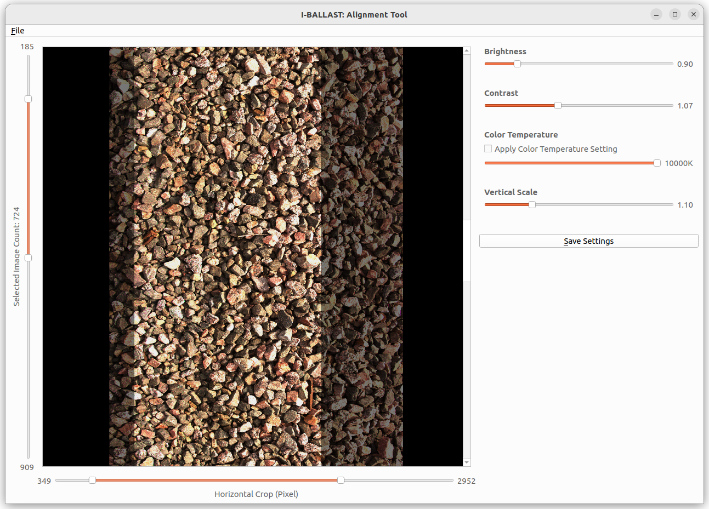
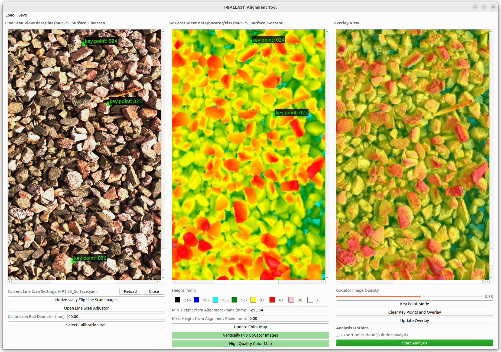
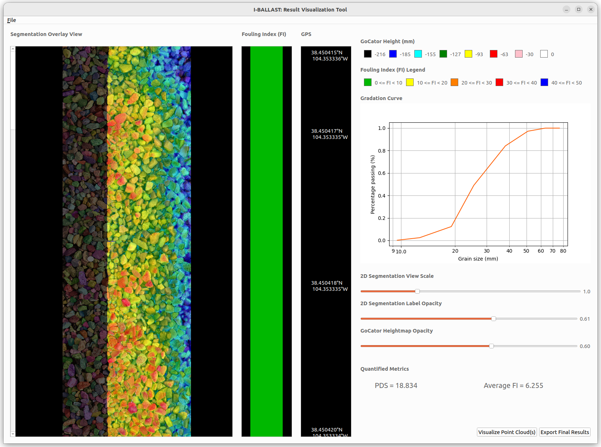
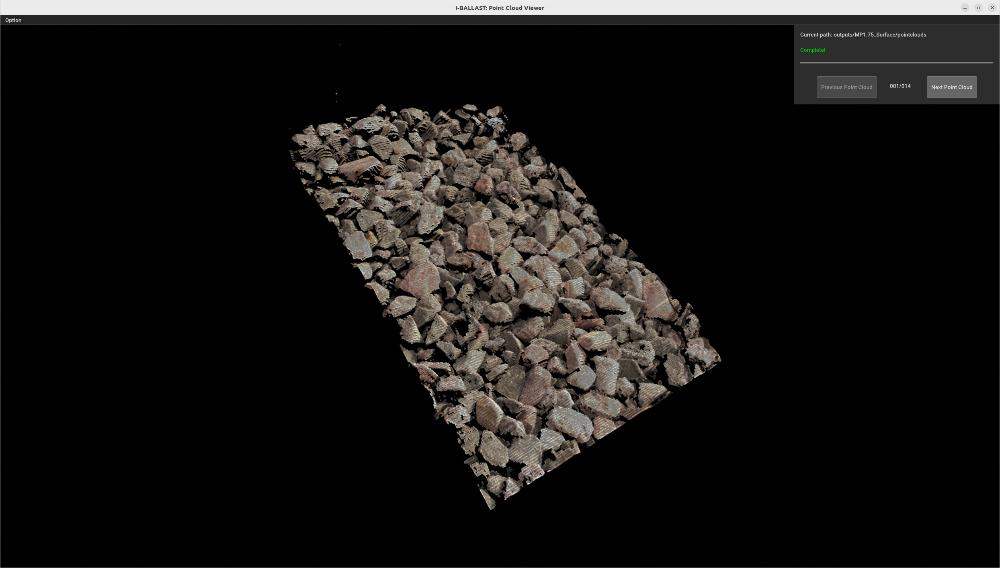

# AggreEvl
Data post-processing and analysis kit for Ballast Scanning Vehicle (BSV)

#### Directory Setting
```
ROOT/PATH
    --- AggreEvl
    --- swin
```

#### Preparation
```
swin transformer dependency
requirements.txt
```

#### Tool I: Line Scan Image Adjustor


```sh

python gui/app/linescanAdjustor/app.py 
```

#### Tool II: Alignment Tool


```sh
python gui/apps/alignmentTool/app.py
```

#### Tool III: Result Visualizer



```sh
python gui/apps/resultVisualizationTool/app.py 
```
